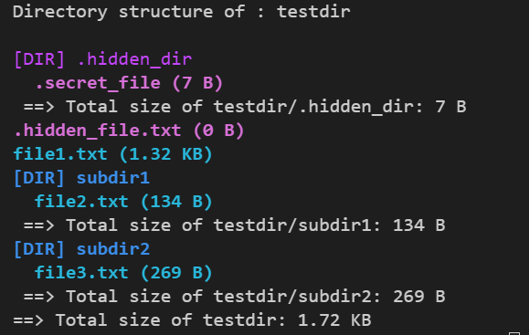

# Simple Disk Usage Visualiser
This is a simple command-line tool written in C that recursively traverses directories in a Linux/Unix environment, calculates disk usage, and displays the directory structure with colour-coded files and folders. The tool provides readable file sizea (B, KB, MB, GB), supports indentation to visualise folder hierarchy, highlights hidden files and directories, and offers sorting options.

## Features
- Recusively traverses directories and subdirectories
- Calculates and displays total size of each directory
- Formats file size in human-readbale units (Bytes, KB, MB, GB)
- Prints directory structure with indentation reflecting depth
- Colour-coded output:
    - **Directories:** BLUE
    - **Hidden directories:** PURPLE
    - **Files:** CYAN
    - **Hidden Files:** MAGENTA
- Option to sort files and directories alphabetically
- Option to include hidden files/directories

## Prerequisites
- GCC compiler (or any C compiler)
- Linux, macOS, or Windows with WSL

## Build instructions
```
git clone https://github.com/PeaceSamuel03/disk-usage-visualiser.git
cd disk-usage-visualizer
make
```

## Usage
```
./diskusage [directory] [options]
```
- directory --> directory path to analyse
- options: -n (sort alphabetically), -h (include hidden files & directories)

## Sample output


## Credits
Created by Peace Samuel.
